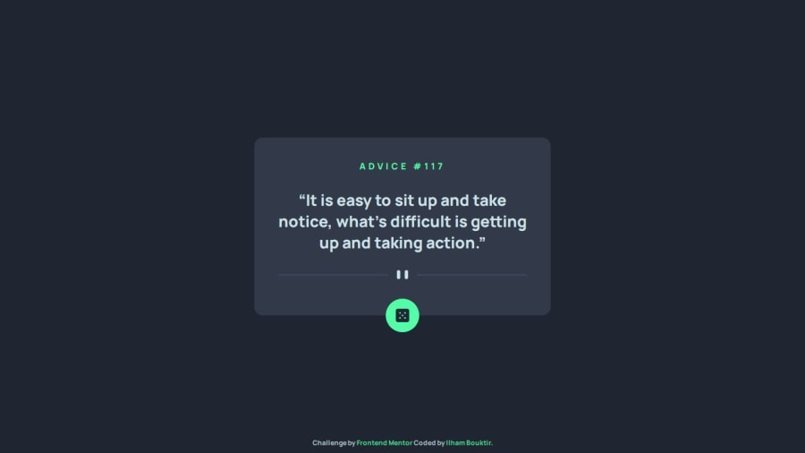

# Frontend Mentor - Advice generator app solution

This is a solution to the [Advice generator app challenge on Frontend Mentor](https://www.frontendmentor.io/challenges/advice-generator-app-QdUG-13db). Frontend Mentor challenges help improve coding skills by building realistic projects. 

## Table of contents

- [Overview](#overview)
  - [The challenge](#the-challenge)
  - [Screenshot](#screenshot)
  - [Links](#links)
- [My process](#my-process)
  - [Built with](#built-with)
  - [What I learned](#what-i-learned)
  - [Continued development](#continued-development)
- [Author](#author)
- [Acknowledgments](#acknowledgments)

## Overview

### The challenge

Users should be able to:

- View the optimal layout for the app depending on their device's screen size
- See hover states for all interactive elements on the page
- Generate a new piece of advice by clicking the dice icon

### Screenshot



### Links

- Solution URL: [solution URL](https://www.frontendmentor.io/solutions/responsive-advice-generator-app-solution-YxZRLaZv1X)
- Live Site URL: [Live site](https://ilham-bouk.github.io/Advice_generator_app/)

## My process

### Built with

- Semantic HTML5 markup
- CSS custom properties
- Flexbox
- Grid CSS
- Desktop-first workflow
- Fitch API

### What I learned

This challenge provided valuable practice for my coding skills, Especially since I don't used fitch api for a long time.

```js
btn.addEventListener("click", () => {
  fetch(apiUrl)
    .then((response) => response.json())
    .then((response) => {
      // console.log(response);
      let data = response.slip;
      advNum.innerHTML = data.id;
      advQuote.innerHTML = data.advice;
    }).catch(error => console.error(error));
})
``` 

### Continued development


### Useful resources

- [Using the Fetch API](https://developer.mozilla.org/en-US/docs/Web/API/Fetch_API/Using_Fetch)
- [Fitch API](https://elzero.org/javascript-2021-fetch-api/) - .

## Author

- Frontend Mentor - [@ilham-bouk](https://www.frontendmentor.io/profile/ilham-bouk)
- LinkedIn - [Ilham Bouktir](https://www.linkedin.com/in/ilham-bouktir-0b266b31b)

## Acknowledgments

A big thank you to anyone providing feedback on [my solution](https://www.frontendmentor.io/solutions/responsive-advice-generator-app-solution-YxZRLaZv1X). It definitely helps to find new ways to code and find easier solutions!

**Happy coding!** ☺️🚀 
